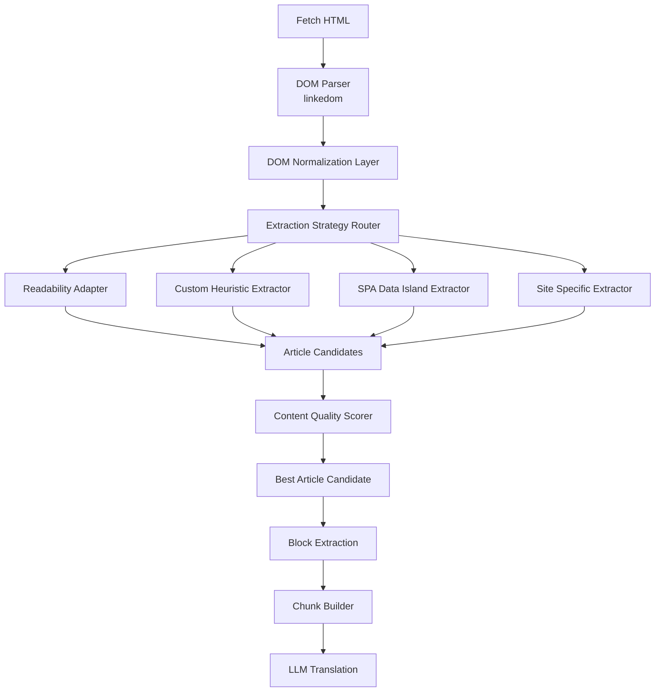
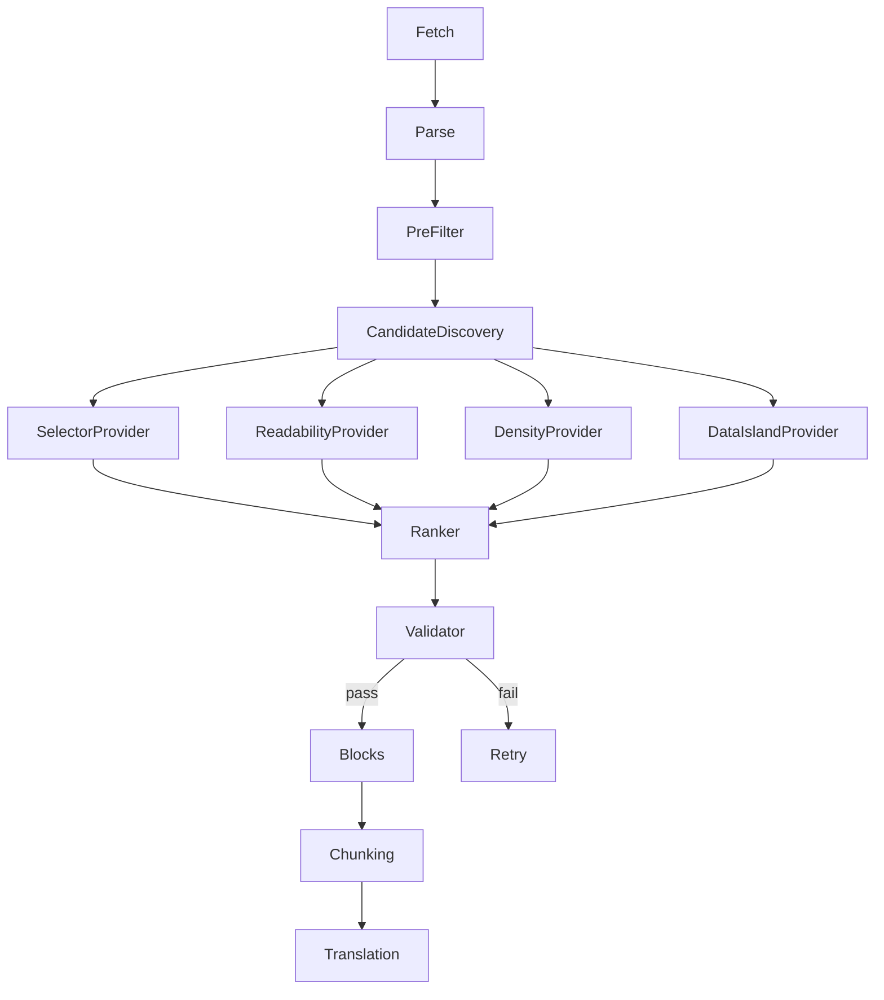
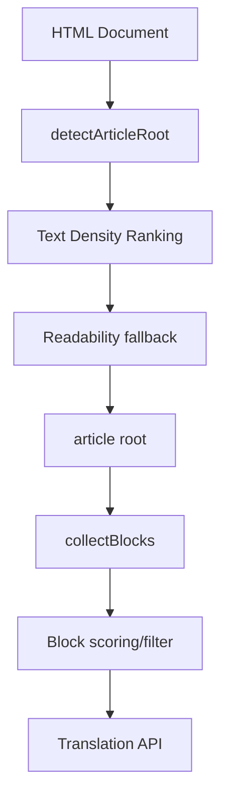
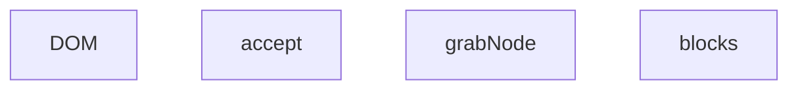
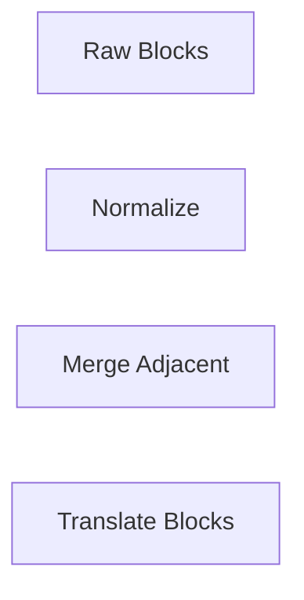
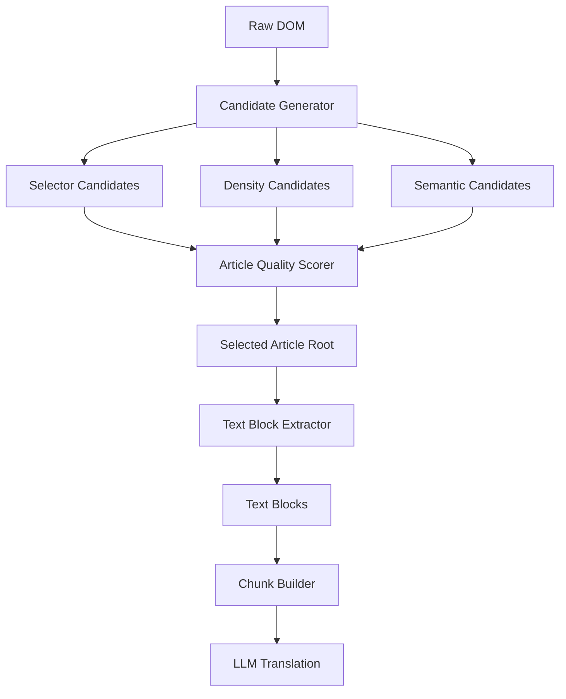
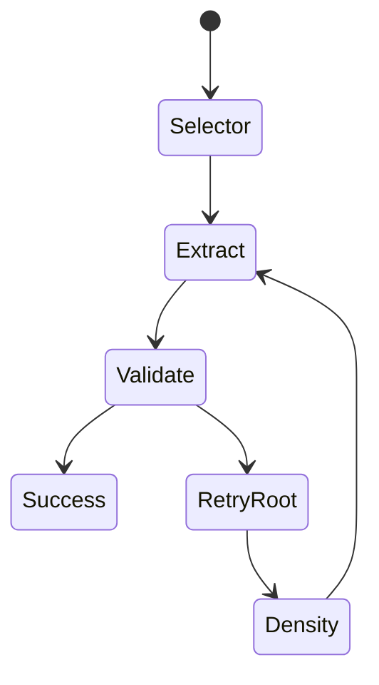

# 架构设计

可以，而且 Cloudflare Worker 场景下非常适合把当前实现从“规则堆叠型 extractor”改造成“多策略正文抽取引擎”。当前代码的问题不是能力不足，而是**所有策略耦合在一个 extraction pipeline 中**：selector、heuristic、noise filtering、SPA fallback、site rule 都直接影响 root 选择。引入 MDN 的 `@mozilla/readability`（Mozilla Readability）后，最佳方向不是替代，而是作为一个 **baseline extractor**，与现有 heuristic extractor 并行，通过统一评分选择结果。

整体架构建议：



---

# 1. 把当前 findArticleRoot 降级为 Candidate Provider

现在：

```ts
findArticleRoot()
        |
        return Element
```

改成：

```ts
interface ArticleCandidate {
    source:
      | "readability"
      | "selector"
      | "heuristic"
      | "data-island"
      | "site-rule";

    root: Element | null;

    title?: string;

    textLength:number;

    blockCount?:number;

    score?:number;

    metadata?:ArticleMetadata;
}
```

每一种 extractor 不负责决定最终结果，只负责产生候选。

例如：

```ts
class ReadabilityExtractor {

 extract(doc:Document):ArticleCandidate|null {

    const reader =
       new Readability(doc);

    const article =
       reader.parse();


    if(!article)
       return null;


    return {
       source:"readability",
       root:createArticleRoot(article),
       title:article.title,
       textLength:article.textContent.length
    };
 }
}
```

---

# 2. Readability 作为第一候选，而不是 fallback

Mozilla Readability 的优势：

* 长期经过 Firefox Reader Mode 验证；
* 对新闻、博客、Medium、WordPress 很强；
* 自动处理：

  * byline
  * timestamp
  * comments
  * related articles
  * ads

但是它的问题：

* 不理解你的双语 overlay；
* 会 clone DOM；
* 对 SaaS docs / marketing page 较弱；
* Cloudflare Worker 环境需要 adapter。

所以：

不要：

```
Readability 成功
    |
    return
```

应该：

```
Readability
      |
      candidate A

Custom
      |
      candidate B

Scoring
      |
      winner
```

---

# 3. 增加统一 Content Quality Model

当前：

```ts
scoreArticleContainer()
```

建议改：

```ts
interface ContentScore {

    total:number;

    signals:{
        textDensity:number;

        paragraph:number;

        heading:number;

        linkDensity:number;

        boilerplate:number;

        language:number;

        duplication:number;
    }
}
```

评分：

```ts
function scoreCandidate(
    candidate:ArticleCandidate
):ContentScore {


return {

total:
    densityScore +
    paragraphScore +
    headingScore -
    boilerplatePenalty -
    linkPenalty,


signals:{
    textDensity,
    paragraph,
    heading,
    linkDensity,
    boilerplate,
    language,
    duplication
}

};

}
```

核心指标：

## Text Density

```ts
density =
articleTextLength /
allTextLength
```

## Link Density

导航页：

```text
100 words

80 links
```

正文：

```text
100 words

2 links
```

公式：

```ts
linkDensity =
linkTextLength / textLength
```

## Boilerplate Ratio

例如：

cookie/footer/sidebar：

```ts
noiseChars / totalChars
```

---

# 4. Worker 环境不要保留完整 DOM clone

这是 Cloudflare Worker 最大限制。

Readability 默认：

```js
new Readability(document)
```

内部：

* clone node
* remove node
* scoring

对于 Worker：

CPU 预算有限。

建议：

两阶段：

## Stage 1

轻量 heuristic:

```text
找候选区域
```

例如：

```ts
ARTICLE_SELECTORS
detectArticleRoot()
```

得到：

```html
<article-body>
```

然后：

## Stage 2

只对候选 subtree 使用 Readability。

不要：

```ts
Readability(document)
```

改：

```ts
const candidate =
findBroadCandidate(document);


const article =
new Readability(candidate.ownerDocument)
```

或者：

clone candidate。

这样：

大型页面：

```
30000 nodes

↓

5000 nodes

↓

Readability
```

CPU 会明显下降。

---

# 5. 建立 Extraction Pipeline

推荐最终：



---

# 6. Site Rule 不应该删除，而应该降低优先级

现在：

```ts
if(siteRule.articleRootSelector)
{
 return el;
}
```

风险：

规则错误直接覆盖所有算法。

改：

```ts
SiteRuleProvider

priority:100
```

其他：

```ts
ReadabilityProvider
priority:70

SelectorProvider
priority:60

DensityProvider
priority:50
```

统一排序：

```ts
candidates
    .map(score)
    .sort(score)
    .first()
```

这样：

特殊站点仍可 override，但是不会污染架构。

---

# 7. 针对你的翻译场景，增加 Translation-aware Extractor

这是普通 Readability 没有的。

例如：

文章：

```html
<h1>
Claude Code Overview
</h1>


<div class="hero">
...
</div>


<div class="article-body">
...
</div>
```

Reader:

可能只取：

```
article-body
```

但是你的需求：

需要：

```
title
+
hero description
+
body
```

所以增加：

```ts
interface ArticleContent {

title:string;

summary?:string;

blocks:TextBlock[];

metadata:{
 author?:string;
 date?:string;
};

}
```

不要只返回 HTMLElement。

---

# 8. Cloudflare Worker 推荐最终模块结构

```text
src/
 ├─ extraction/
 │
 │   ├─ pipeline.ts
 │
 │   ├─ candidates/
 │   │    ├─ readability.ts
 │   │    ├─ selector.ts
 │   │    ├─ density.ts
 │   │    └─ dataIsland.ts
 │
 │   ├─ scoring/
 │   │    ├─ qualityScore.ts
 │
 │   ├─ validation/
 │   │    └─ articleValidator.ts
 │
 │   └─ blocks/
 │        └─ blockExtractor.ts
 │
 ├─ translation/
 │
 └─ rules/
```

---

## 结论

你的当前实现继续增加规则，预计会进入：

```
100 sites
100 exceptions
200 regex
```

维护成本快速增加。

更好的演进路线：

1. **保留现有 extractor，改造成 Candidate Provider**
2. **引入 Readability 作为通用候选生成器**
3. **增加统一 Quality Scoring**
4. **winner 决策后才进入 block/chunk/translation**
5. **Site Rule 从硬覆盖改成高权重候选**
6. **针对翻译需求扩展 ArticleContent，而不是只抽 HTML**

对于 Cloudflare Worker，这个架构比单纯使用 Readability 更合适，因为它兼顾：

* 新闻博客（Readability 强项）
* SaaS 文档（你的 heuristic 强项）
* SPA/Next.js（data island 强项）
* 特殊站点（site rule）
* 双语 DOM 注入需求（你的核心场景）


-----------------


整体看，这套代码已经不是简单的 DOM extractor，而是一个「正文检测 + 翻译块切分」系统。设计方向正确，尤其是你解决过的几个问题（linkedom TreeWalker 兼容、Shadow DOM、O(N²) 缓存、Readability fallback）都属于生产级浏览器扩展会遇到的问题。

但当前版本仍有几个架构级问题，其中部分会直接影响翻译质量，而不是性能。

---

## 1. 最大问题：`detectArticleRoot` 和 `collectBlocks` 两套算法目标冲突

当前流程实际上是：



问题：

`detectArticleRoot` 已经试图回答：

> 哪一块是正文？

而 `collectBlocks` 又重新回答：

> 哪些节点是正文？

两个阶段存在大量重复判断。

例如：

```html
<body>
  <main class="article">
      <article>
          <section>
              paragraph
          </section>
      </article>
  </main>
</body>
```

第一次：

```
detectArticleRoot:
main score = 50000
article score = 48000

选择 main
```

第二次：

```
collectBlocks(main)

article ACCEPT
section ACCEPT
paragraph ACCEPT
```

实际上 root detection 已经知道：

```
main > article > section
```

但是 block extractor 重新遍历整个子树。

---

建议：

把 `detectArticleRoot` 输出的信息传给 `collectBlocks`：

```ts
interface ArticleContext {
    root: Element;

    confidence: number;

    candidates: {
        element: Element;
        score: number;
    }[];

    semanticHints: {
        isArticle: boolean;
        hasCode: boolean;
        hasMath: boolean;
    };
}
```

然后：

```ts
collectBlocks(
    root,
    {
       mode:"article"
    }
)
```

不要再全量运行：

```ts
shouldSkipBySiteRules()
isMetadataClass()
isLowPriorityElement()
```

因为 root 阶段已经过滤过一次。

否则：

```
detectArticleRoot
       |
       v
   语义判断
       |
       v
collectBlocks
       |
       v
   再语义判断
```

浪费 CPU，也容易产生冲突。

---

# 2. `headingStack` 逻辑存在语义 bug

这里：

```ts
headingStack.push(
    element.textContent?.trim()
)
```

但是：

```ts
// 不 pop
```

这个设计对于普通文章 OK，但是对于现代 SPA 不正确。

例如：

```html
<h1>React Hooks</h1>

<section>
...
</section>


<h1>Vue Signals</h1>

<section>
...
</section>
```

你的结果：

```
headingStack:

[
 React Hooks,
 Vue Signals
]
```

后面所有 block：

```
headingPath:
[
 React Hooks,
 Vue Signals
]
```

实际上应该：

```
[
 Vue Signals
]
```

你的注释：

> 与原 getHeadingPath 行为一致

这里不成立。

以前：

```ts
getHeadingPath(node)
```

是：

```
向上找 ancestor heading
```

不是：

```
document 前面所有 heading
```

两者语义不同。

---

推荐：

改成真正 DFS stack：

```ts
interface HeadingContext {
    level:number;
    text:string;
}
```

进入：

```ts
if heading:

    headingStack.push()

```

退出：

```ts
finally {
    if(push)
       headingStack.pop()
}
```

即：

```ts
function walkNode(){

 let pushed=false;

 if(isHeading(node)){
    headingStack.push(...)
    pushed=true;
 }


 recurse()


 if(pushed)
    headingStack.pop()
}
```

复杂度仍然：

```
O(N)
```

但是语义正确。

---

# 3. `scoreElement` 里面 sibling normalization 有 O(N²) 风险

这里：

```ts
const siblings = parent.children;

for(...)
{
    siblings[i].textContent
}
```

问题：

如果：

```html
<div>
   5000 children
</div>
```

每个 child 都调用：

```
scoreElement(child)
```

那么：

```
5000 * 5000
```

接近：

```
25 million textContent traversal
```

尤其：

```ts
textContent
```

不是 O(1)。

它会重新扫描 subtree。

---

应该缓存：

```ts
interface ScoreCache {

    textLength:
       WeakMap<Element,number>;

    siblingStats:
       WeakMap<Element,SiblingStats>;

}
```

例如：

```ts
interface SiblingStats {

    count:number;

    maxText:number;

    avg:number;

}
```

一次计算。

---

# 4. `validTextCache` 有隐藏 bug

这里：

```ts
WeakMap<Element, boolean>
```

缓存：

```ts
isValidText(el.textContent,pageUrl)
```

但是：

DOM 是动态的。

YouTube / React / Vue 页面：

```
initial DOM

    |
    v

React hydration

    |
    v

text changed
```

你的 cache 仍然：

```
old result
```

导致：

```
false negative
```

尤其你的场景是：

* SPA
* YouTube
* Reddit
* GitHub

建议：

cache scope 必须是：

```
一次 collectBlocks 调用
```

现在确实如此。

但是：

如果 extension 保存：

```
cache
```

不要。

目前代码没问题，只是需要明确限制。

---

# 5. `isConsentSafeValve` 设计有逻辑漏洞

这里：

```ts
const _consentSafeValveMemo = new WeakSet();
```

这是 global。

不是 per traversal。

问题：

第一次：

```html
<div id="cookie">
    privacy text
</div>
```

长度：

6000

进入：

```ts
WeakSet.add(div)
```

后续：

SPA route:

同一个 element 被复用：

内容变：

```html
<div id="cookie">
    small cookie popup
</div>
```

仍然：

```ts
return true
```

绕过过滤。

应该：

```ts
WalkCache
{
   consentSafeValve:
       WeakMap<Element,boolean>
}
```

---

# 6. 最大性能热点其实不是你优化的地方

你优化：

```
TreeWalker
querySelector
classifyChildren
```

这些已经很好。

但是实际最大热点：

## textContent

大量：

```ts
el.textContent
```

会触发：

```
DOM subtree traversal
```

你的代码中：

出现超过：

30 次。

例如：

```ts
scoreElement()

 textContent
 a.textContent
 sibling.textContent
 body.textContent
```

一个大页面：

```
DOM nodes = 100k
```

可能：

```
100k * 30
```

---

建议增加：

```ts
interface DomMetricsCache {

 textLength:
 WeakMap<Element,number>;

 textContent:
 WeakMap<Element,string>;

 linkCount:
 WeakMap<Element,number>;

}
```

所有地方共享。

这个收益可能比 TreeWalker 优化大。

---

# 7. `computeSoftHint` 当前意义不大

这里：

```ts
if(article) +2
if(content)+2
if(sidebar)-3
```

但是：

你的 score 系统已经：

```
Text Density
+
class signal
+
semantic tag
```

重复。

而且：

```ts
DIRECT_SET
```

这里：

```ts
if(hint <0)
    FILTER_SKIP
```

风险：

```html
<div class="article sidebar">
```

或者：

```html
<div class="content-sidebar">
```

可能误杀。

建议：

soft hint 只进入 score：

不要改变 traversal。

即：

删除：

```ts
FILTER_SKIP
```

改：

```ts
grabNode()
{
 scoreHint
}
```

---

# 8. `Readability fallback` 的方向正确，但定位方式脆弱

这里：

```ts
const signature =
 first paragraph
```

然后：

```ts
textNode.includes(signature)
```

问题：

很多现代网站：

```html
<p>
 TensorFlow
 <span>LiteRT</span>
 is...
</p>
```

或者：

```html
<p>
 line1
 <br>
 line2
</p>
```

容易失败。

更稳：

使用 token overlap：

例如：

Readability:

```
"The new architecture of..."
```

拆：

```ts
[
"new",
"architecture",
"of"
]
```

扫描 text node：

Jaccard:

```
intersection / union
```

超过：

0.7

认为匹配。

---

# 9. 翻译块划分建议增加 parent-child 合并阶段

目前：



缺少：

```
block merge
```

实际网页：

```html
<p>
 This is
 <strong>important</strong>
 text
</p>
```

可能：

```
block1:
This is

block2:
important

block3:
text
```

翻译质量下降。

建议增加：

```ts
interface BlockMergePolicy {

    maxGap:number;

    minLength:number;

    sameParent:boolean;

}
```

阶段：



---

# 优先级排序

如果只改 5 件事：

| 优先级 | 修改                                         | 收益       |
| --- | ------------------------------------------ | -------- |
| P0  | 修 headingStack pop                         | 翻译上下文正确性 |
| P0  | 缓存 textContent/textLength                  | 性能提升最大   |
| P1  | root detector 和 block extractor 共享 context | 降低复杂度    |
| P1  | 删除 softHint traversal 影响                   | 减少误杀     |
| P2  | 增加 block merge                             | 提升翻译自然度  |

整体评价：当前架构已经接近 Readability + Turndown + DOM segmentation 的工业实现水平，主要问题不是算法不足，而是**多个启发式系统叠加后缺少统一上下文模型**。下一阶段应该从“继续增加规则”转向“建立一次评分、一次决策、多阶段复用”的 pipeline。


---------------


你这两段代码实际上已经形成了一个比较完整的 **网页正文抽取系统（Article Extraction Pipeline）**，不是简单 DOM walker。整体设计方向是对的，尤其几个点：

* `ARTICLE_ROOT` 定位 + `extractBlocks` 分离；
* selector → refine → wrapper expansion → scoring；
* DOM extraction → body fallback → data island fallback；
* class/token 噪声过滤；
* site rule escape hatch。

这个方向接近 Readability / Mercury Parser / trafilatura 的工程化路线。

但是如果目标是你的翻译插件（整页翻译 + 双语渲染），目前还有几个架构层面的风险。

---

## 1. 最大问题：Root selection 和 Block extraction 职责边界有些混乱

现在流程：

```text
findArticleRoot()
    |
    v
chooseBestRoot()
    |
    v
extractBlocks()
    |
    v
buildChunks()
```

问题在于：

`chooseBestRoot()` 已经在判断：

* h1
* h2
* author
* date
* paragraph
* image
* nav
* related

这些其实不是 root selection 的职责，而是 **content quality scoring**。

现在：

```
Root score
    +
Block extraction score
    +
Chunk quality
```

三个阶段都在重复判断“是不是正文”。

长期会越来越难维护。

更合理：



Root scorer 只回答：

> 哪个 subtree 最可能是文章？

不要回答：

> 里面有哪些内容。

---

## 2. `chooseBestRoot` 最大隐患：h1 stop condition

这里：

```ts
if (p.querySelector('h1')) break;
```

风险很高。

很多现代网站：

```html
<body>

<header>
<h1>Company Name</h1>
</header>


<main>

<section>
<h1>Article Title</h1>
</section>

<section>
Article body
</section>

</main>

</body>
```

你的算法可能：

```
body
 |
main
 |
section
```

提前停。

尤其：

* docs 网站
* marketing site
* SaaS blog

大量存在。

建议：

不要判断：

```ts
p.querySelector('h1')
```

改：

判断：

```ts
hasArticleLikeHeading(p)
```

例如：

```ts
interface HeadingSignal {
    count:number;
    nearestDistance:number;
    textLength:number;
}


function hasArticleLikeHeading(el:Element):boolean {

 const h1 = el.querySelector('h1');

 if(!h1) return false;


 const text =
   h1.textContent?.trim() ?? "";


 return (
   text.length > 15 &&
   text.length < 200
 );

}
```

标题：

```
Home
Solutions
Products
```

不要算。

---

## 3. scoreArticleContainer 有一个统计污染问题

这里：

```ts
const textLength =
(container.textContent ?? '').trim().length;
```

非常危险。

因为：

```html
<article>

正文 5000 chars

<div class="cookie">
  cookie policy 50000 chars
</div>

</article>
```

结果：

```
textLength = 55000
```

score:

```
+30
```

直接污染。

你前面已经有：

```
SKIP_CLASS_PATTERNS
```

但是 scorer 不知道。

应该复用 extraction 的 noise evaluator。

例如：

```ts
function getReadableTextLength(el:Element){

 let length=0;

 for(const node of el.querySelectorAll("*")){

    if(shouldSkipByClass(node))
        continue;


    length += 
       node.textContent?.length ?? 0;
 }

 return length;

}
```

否则：

root scorer 和 extractor 对正文理解不一致。

---

## 4. Data Island fallback 目前太弱

这里：

```ts
DATA_ISLAND_PRIORITY_FIELDS =
/^(articleBody|text|content|description...)$/i;
```

对于 Next.js：

现在大量结构：

```json
{
 "props":{
   "pageProps":{
      "article":{
          "blocks":[
             {
              "children":[
                 {
                  "text":"hello"
                 }
              ]
             }
          ]
      }
   }
 }
}
```

你的递归：

```
article
 |
blocks
 |
children
 |
text
```

可以拿到。

但是会丢失结构。

例如：

```json
{
"type":"heading",
"text":"Introduction"
}
{
"type":"paragraph",
"text":"xxx"
}
```

最终：

```
Introduction

xxx
```

没有 tag。

建议：

定义：

```ts
interface DataIslandBlock {

 text:string;

 type:
   |"heading"
   |"paragraph"
   |"code"
   |"quote";

 level?:number;

}
```

否则 chunk builder 无法优化。

---

## 5. `isNoiseSafeValve` 有一个逻辑漏洞

现在：

```ts
if(text.length > 5000)
{
 return false;
}
```

意思：

```
cookie class
+
50000 text

=> 正文
```

但是：

真实情况：

```
cookie modal
+
cookie policy
+
50000 text
```

仍然可能存在。

更好的判断：

不要只看长度。

改：

```ts
interface NoiseDecision {

isNoise:boolean;

confidence:number;

}
```

例如：

cookie:

```
cookie
privacy
consent
accept
reject
preferences
```

正文：

```
paragraph density high
h2 count high
p count high
```

---

## 6. 缺少一个核心指标：Text Density

现在你的 scoring：

```
length
paragraph
image
author
time
```

但正文抽取领域最重要的是：

```
text density
```

定义：

```ts
density =
meaningfulTextLength /
totalTextLength
```

例如：

新闻正文：

```
8000 / 9000
=0.88
```

首页：

```
8000 / 30000
=0.26
```

加入：

```ts
const density =
readableTextLength /
container.textContent.length;


score += density * 30;
```

这一个指标通常比：

```
image count
author
time
```

更有效。

---

## 7. blockExtractor 里面 class matching 有性能问题

这里：

```ts
for token:
   for pattern:
```

复杂度：

```
O(nodes * tokens * patterns)
```

大型页面：

```
10000 nodes
平均 class 5
patterns 100
```

约：

```
5 million regex/string match
```

可以优化。

启动时：

```ts
const SKIP_SET = new Set([
"footer",
"sidebar",
"cookie"
])
```

流程：

```ts
function shouldSkip(el){

 const tokens = tokenize(el);


 for(const token of tokens){

    if(SKIP_SET.has(token))
       return true;


    if(matchRegex(token))
       return true;
 }

}
```

先 O(1)，最后 regex。

---

## 8. 目前缺少 Extract Quality Feedback Loop

对于翻译插件，这是最重要的。

应该输出：

```ts
interface ExtractionReport {

rootSelector:string;

blockCount:number;

textLength:number;

headingCount:number;

chunkCount:number;

noiseRatio:number;

confidence:number;

}
```

例如：

```json
{
"root":".article-body",
"blocks":87,
"textLength":12000,
"noiseRatio":0.03,
"confidence":0.94
}
```

然后：

如果：

```
confidence < 0.5
```

自动：

```
retry root strategy
```

类似：



---

# 优先级建议

如果保持当前架构，不大改，我建议按收益排序：

| 优先级 | 修改                                        | 收益              |
| --- | ----------------------------------------- | --------------- |
| P0  | score 使用 readable text，不用 raw textContent | 防止大量误判          |
| P0  | 增加 text density score                     | 提升未知站点成功率       |
| P1  | remove h1 stop condition                  | 减少 SaaS/blog 误判 |
| P1  | ExtractionReport                          | 快速定位失败案例        |
| P2  | DataIsland 保留 block type                  | 提升 SPA 站点质量     |
| P2  | token skip 优化                             | 大页面性能           |
| P3  | ML/embedding root ranking                 | 后续演进            |

整体上，这套代码已经超过普通 DOM extractor。下一步不是继续增加 selector，而是把它演化成 **Candidate Generation → Scoring → Validation → Feedback Retry** 的抽取引擎，否则随着站点规则增长，会逐渐进入规则爆炸。
