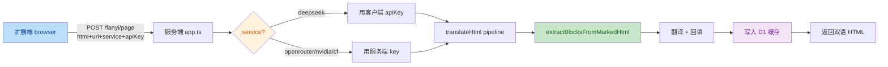

# 代码审查报告 — /fanyi/page 多服务支持

审查日期：2026-06-18
审查范围：`/fanyi/page` 端点多服务支持相关代码（vocal-saga 服务端 + fanyi-extension 扩展端）

## 变更概览



## 问题汇总

| No. | 问题 | 严重度 | 代码位置 |
|-----|------|--------|----------|
| 1 | 扩展端 `serverTranslation.ts` 硬编码 `service='deepseek'`，`config.ts` 缺少 `service` 字段，UI 无服务端 service 选择——多服务切换功能未实现 | Major | `fanyi-extension/src/entrypoints/content/serverTranslation.ts:39` |
| 2 | D1 缓存键不包含 `service`，不同服务翻译结果会互相覆盖（deepseek 翻译后切 openrouter 命中 deepseek 缓存） | Major | `vocal-saga/lib/app.ts:319-331` |
| 3 | `cacheKeyUrl` 是恒等函数（`return url`），但 `app.ts` 多处注释声称"www 和非 www 共享同一缓存"，实际不共享——注释误导 | Minor | `vocal-saga/lib/urlUtils.ts:32-37` |
| 4 | `configPanel.ts` 引用不存在的 `.fanyi-server-service-row` 元素（死代码，多服务 UI 未完成的残留） | Minor | `fanyi-extension/src/entrypoints/content/configPanel.ts:195-197` |
| 5 | `/fanyi/page` 未对 `url` 做标准化（不像 `/translate/*` 用 `normalizeUrl`），不同格式 url（有/无 scheme）导致缓存键不一致 | Minor | `vocal-saga/lib/app.ts:274-278` |

---

## 问题详情

### 问题 1 — 扩展端多服务支持未实现（Major）

**用户需求**：用户明确要求"fanyi/page 会输入这些选项，可以切换配置；除了 deepseek 使用传入的 apikey，其它的使用 server 端的 key"。

**当前状态**：服务端 `/fanyi/page` 已支持多服务（deepseek/openrouter/nvidia/cloudflare），但扩展端代码未实现多服务切换：

- `fanyi-extension/src/entrypoints/content/serverTranslation.ts:39` 硬编码：
  ```typescript
  const service = 'deepseek';
  ```
- `fanyi-extension/src/entrypoints/utils/config.ts` 的 `Config` 接口没有 `service` 字段，`defaultConfig` 也没有。
- `fanyi-extension/src/entrypoints/popup/App.vue` 只有本地 `provider` 选择（用于本地翻译），没有服务端 `service` 选择。
- `fanyi-extension/src/entrypoints/content/configPanel.ts` 同样只有本地 `provider` 选择。

**影响**：扩展端永远发送 `service: 'deepseek'`，用户无法在扩展端切换服务端翻译服务。服务端的多服务能力对扩展端用户不可用。

**建议修复**：
1. `config.ts` 的 `Config` 接口添加 `service: Provider` 字段，`defaultConfig` 添加 `service: 'deepseek'`。
2. `App.vue` 在 `useServerTranslation` 开启时显示服务端 `service` 选择下拉框。
3. `configPanel.ts` 在服务端翻译开关开启时显示 `service` 选择，并添加对应的 `.fanyi-server-service-row` HTML。
4. `serverTranslation.ts` 从 `config.service` 读取服务类型，仅当 `service === 'deepseek'` 时校验并发送 `apiKey`。

---

### 问题 2 — D1 缓存不区分 service（Major）

**代码位置**：`vocal-saga/lib/app.ts:319-331`（缓存查询）、`vocal-saga/lib/app.ts:334-345`（缓存写入）。

**问题**：`/fanyi/page` 的 D1 缓存键是 `url + source_lang + target_lang`，不包含 `service`：

```typescript
const existing: any = await db.prepare(
  'SELECT html FROM translations WHERE url = ? AND source_lang = ? AND target_lang = ? LIMIT 1'
).bind(cacheKey, sourceStored, targetStored).first();
```

**影响**：
1. 用户先用 deepseek 翻译 `example.com`，结果存入 D1。
2. 用户切换到 openrouter 再次翻译 `example.com`，命中 D1 缓存，直接返回 deepseek 的翻译结果。
3. openrouter 翻译永远不会执行，用户以为切换了服务但实际没有。

**建议修复**：
- 方案 A：缓存键加入 `service` 字段（需修改 D1 schema，增加 service 列）。
- 方案 B：如果业务上认为同一 URL 的翻译结果可以跨服务复用，则在文档中明确说明，并移除"切换服务"的 UI 暗示。
- 推荐方案 A，与其他翻译路由（`/translate/*`、`/nvd/*` 等）的行为保持一致。

---

### 问题 3 — cacheKeyUrl 注释与代码不一致（Minor）

**代码位置**：
- `vocal-saga/lib/urlUtils.ts:32-37`：`cacheKeyUrl` 函数只是 `return url;`，注释说"www.example.com 和 example.com 暂时视为不同 URL"（与代码一致）。
- `vocal-saga/lib/app.ts:336`、`app.ts:448`、`app.ts:493`：三处注释都说"www 和非 www 共享同一缓存"——这是错误的。

**影响**：`app.ts` 的注释误导开发者以为 `cacheKeyUrl` 会标准化 www，实际不会。未来修改缓存逻辑时可能基于错误假设。

**建议修复**：统一注释，移除 `app.ts` 中"www 和非 www 共享同一缓存"的错误描述，改为"缓存键直接用完整 URL，www 和非 www 视为不同"。

---

### 问题 4 — configPanel.ts 死代码（Minor）

**代码位置**：`fanyi-extension/src/entrypoints/content/configPanel.ts:195-197`。

**问题**：`wirePanelEvents` 中引用了 `.fanyi-server-service-row`：

```typescript
const serverServiceRow = panel.querySelector('.fanyi-server-service-row') as HTMLElement | null;
if (useServerCheckbox) {
  useServerCheckbox.addEventListener('change', () => {
    const display = useServerCheckbox.checked ? '' : 'none';
    if (serverUrlRow) serverUrlRow.style.display = display;
    if (serverServiceRow) serverServiceRow.style.display = display;
  });
}
```

但 `buildPanelHtml` 中没有 `.fanyi-server-service-row` 元素，`serverServiceRow` 永远是 `null`。这是多服务 UI 未完成的残留代码。

**影响**：不会报错，但属于死代码，且暗示功能未完成。

**建议修复**：如果实现问题 1 的多服务 UI，则在 `buildPanelHtml` 中添加 `.fanyi-server-service-row` 元素；否则移除这段死代码。

---

### 问题 5 — /fanyi/page 未对 url 做标准化（Minor）

**代码位置**：`vocal-saga/lib/app.ts:274-278`。

**问题**：`/fanyi/page` 直接用 `body.url` 作为缓存键和 base URL，不做标准化：

```typescript
const { html, url } = body;
if (!url || typeof url !== 'string') {
  return c.json({ error: 'url is required' }, 400);
}
```

而 `/translate/*` 等路由用 `normalizeUrl` 标准化（剥 scheme、补 .com）。

**影响**：
- 如果用户传 `example.com`，缓存键是 `example.com`。
- 如果用户传 `https://example.com`，缓存键是 `https://example.com`。
- 两者不会命中同一缓存。
- 扩展端总是传 `window.location.href`（含 scheme），所以实际影响较小，但与其他路由行为不一致。

**建议修复**：`/fanyi/page` 的 `url` 主要用于缓存键和 base URL（不用于 fetch），可以不强制 https，但应统一缓存键格式。可用 `cacheKeyUrl` 做轻量标准化（如剥 trailing slash），或在文档中明确说明扩展端必须传完整 URL。

---

## 测试覆盖情况

`tests/appRoutes.test.ts` 覆盖了 `/fanyi/page` 的以下场景：
- 正常翻译（html + url + apiKey）
- 缺少 html / url / apiKey 时的 400 错误
- 非 deepseek 服务不需要 apiKey
- 无效 service 返回 400
- service/apiKey/mode 透传到 translateHtml
- translateHtml 抛错返回 500
- D1 缓存命中直接返回
- D1 缓存未命中写入

**未覆盖的场景**：
- 多服务切换时 D1 缓存隔离（问题 2）
- 扩展端多服务 UI 交互（问题 1）
- url 格式不一致时的缓存行为（问题 5）
